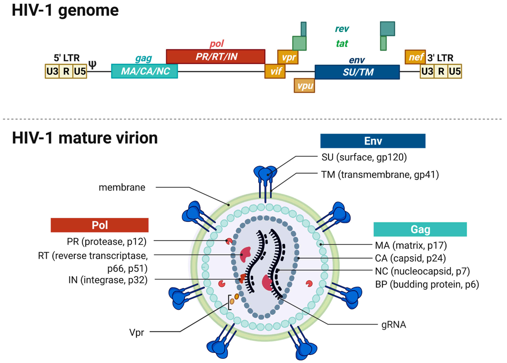

# HIV-1 Drug Resistance Mutation Tracker

## Overview

This project analyzes 40 real, publicly available HIV-1 *pol* gene sequences
(protease + partial reverse transcriptase region) from NCBI GenBank to
identify amino-acid-level mutation hotspots, and checks whether those
hotspots correspond to positions known to be involved in antiretroviral
drug resistance.

The project is an exploratory sequence-analysis study designed to connect
raw viral sequence data with biologically meaningful variation and known
drug-resistance sites.

---

## Biological Background

### What is HIV?

**HIV (Human Immunodeficiency Virus)** is a virus that attacks cells of the
human immune system, particularly **CD4 T cells**.

Like other viruses, HIV cannot reproduce independently. Instead, it enters a
host cell and uses the cell's molecular machinery to produce new copies of
itself.

HIV carries its genetic information as **RNA** rather than DNA. After entering
a suitable host cell, HIV converts its RNA into DNA using an enzyme called
**reverse transcriptase**. The viral DNA can then be integrated into the
host cell's DNA by another viral enzyme called **integrase**.

Once integrated, the viral genetic information can be used by the host cell
to produce viral RNA and proteins. These components are assembled into new
virus particles, which eventually mature and become capable of infecting
additional cells.


Because these processes depend on several viral enzymes, those enzymes are
important targets for **antiretroviral therapy (ART)**.

---

## What is the `pol` gene?

The HIV genome contains several genes and genetic regions that are required
for producing a functional virus. One of the most important is **`pol`**.

The `pol` gene encodes several enzymes that are essential for HIV replication:

- **Protease (PR)** — cuts large viral precursor proteins into smaller,
  functional proteins during viral maturation.
- **Reverse transcriptase (RT)** — converts HIV RNA into DNA.
- **Integrase (IN)** — inserts viral DNA into the host cell's genome.

These proteins are therefore part of the core molecular machinery that allows
HIV to reproduce.

A simplified representation is:




HIV has a relatively small genome, so it uses compact strategies to encode
multiple functional proteins. For example, viral proteins can initially be
produced as larger precursor proteins and later processed by protease into
their mature forms.

---

## Why focus on `pol`?

The `pol` region is particularly relevant to drug-resistance research because
its protein products are essential to HIV replication and are major targets
of antiretroviral drugs.

For example:

| `pol` product | Main function | Drug relevance |
|---|---|---|
| Protease | Viral protein maturation | Protease inhibitors |
| Reverse transcriptase | RNA → DNA | Reverse transcriptase inhibitors |
| Integrase | Viral DNA integration | Integrase inhibitors |

Mutations in these proteins can sometimes alter how well an antiretroviral
drug interacts with its target.

However, **not every mutation causes drug resistance**.

A sequence variation may be:

- biologically neutral,
- a natural polymorphism found among circulating HIV variants,
- harmful to viral fitness,
- or, under certain circumstances, associated with reduced susceptibility
  to a drug.

Drug resistance therefore requires biological interpretation beyond simply
finding a mutation.

This project focuses on identifying **where variation occurs first**, and
then asking whether highly variable positions overlap with positions already
known to be associated with drug resistance.

---

## Motivation

HIV has a high rate of genetic variation, allowing genetically different
viral variants to arise within and between infected individuals.

When antiretroviral drugs are present, variants that are less susceptible to
a particular drug can have a selective advantage. Mutations affecting viral
proteins targeted by drugs can therefore become important in the context of
treatment.

Certain positions in the HIV protease and reverse transcriptase proteins are
well-documented resistance-associated sites.

This project asks:

> **Can biologically meaningful mutation hotspots be recovered directly from
> public HIV-1 sequence data using sequence alignment and information-theory-
> based variation analysis, without using prior drug-resistance annotations
> during hotspot detection?**

The goal is not to diagnose resistance or predict treatment outcomes, but to
demonstrate a lightweight approach for discovering candidate variable
positions that can subsequently be compared against established
drug-resistance knowledge.

---

## Data

- Source: NCBI GenBank (`nuccore`), HIV-1 *pol* gene, partial CDS
- 40 sequences, ~1981 bp aligned length
- Reference for coordinate mapping: HXB2 (accession K03455)

The sequences contain the protease and partial reverse transcriptase regions
of HIV-1 `pol`, allowing the analysis to examine amino-acid variation in
proteins that are highly relevant to viral replication and antiretroviral
therapy.

---

## Pipeline

1. `scripts/01_fetch_sequences.R` — retrieve HIV-1 *pol* sequences from NCBI
   via `rentrez`
2. `scripts/02_inspect_sequences.R` — sanity-check fetched sequences
3. `scripts/03_align.R` — nucleotide multiple sequence alignment
   (`DECIPHER`)
4. `scripts/04_analysis.R` — neighbor-joining phylogenetic tree +
   nucleotide-level entropy scan
5. `scripts/05_protein_hotspots.R` — translate to protein, align, and compute
   per-residue Shannon entropy
6. `scripts/06_map_to_hxb2.R` — map alignment positions onto standard HXB2
   reference numbering
7. `scripts/07_visualize.R` — final hotspot plot and phylogenetic tree figure

The biological logic of the pipeline is:

```text
Raw HIV-1 sequences
        ↓
Sequence alignment
        ↓
Compare corresponding positions
        ↓
Measure variation at each position
        ↓
Identify highly variable amino-acid positions
        ↓
Map positions to HXB2 numbering
        ↓
Compare with known drug-resistance sites
```

---

## Method

Mutation hotspots were identified using **Shannon entropy** at each aligned
amino-acid position across all 40 sequences.

Entropy provides a measure of how much variation exists at a position.

Conceptually:

```text
Low entropy
    ↓
Most sequences have the same amino acid
    ↓
Conserved position


High entropy
    ↓
Several amino acids are observed
    ↓
Variable / candidate hotspot
```

The analysis therefore does **not** begin by looking for known resistance
mutations. Instead, it first identifies positions showing unusually high
variation in the sampled sequences.

These positions can then be compared with established biological and
clinical knowledge.

---

## Results

### Phylogenetic relationships


Most sequences form a tight, closely related cluster (near-zero branch
lengths), with a handful of more divergent isolates (e.g. PX471194, PX471205,
PX471185, PX471187) branching off with visibly longer branches — suggesting
a dominant circulating lineage alongside more distinct variants in this
sample.

### Mutation hotspots


The top 20 highest-entropy amino acid positions (red points) are concentrated
in specific regions rather than spread uniformly.

This is biologically interesting because viral proteins are not equally
tolerant of change. Some positions are structurally or functionally
constrained, while others can tolerate more variation.

### Comparison to known drug-resistance sites

After mapping our top hotspots onto standard HXB2 reference numbering, one
position (RT residue **138**) corresponds to **E138**, a documented NNRTI
accessory resistance-associated position. Substitutions such as E138K/A/G
have been associated with reduced susceptibility to certain NNRTIs,
including rilpivirine.

This provides an interesting example of a sequence-derived hotspot
overlapping with a known drug-resistance-associated position.

Other top hotspots did not clearly match major resistance codons in this
pass. These may represent natural polymorphism sites, other biologically
variable positions, or may be affected by the coordinate-mapping limitations
described below.

---

## Key Finding

Shannon-entropy-based hotspot detection, applied to 40 public HIV-1 *pol*
sequences without using resistance annotations during hotspot detection,
identified a variable position corresponding to the known RT E138
drug-resistance-associated site.

This demonstrates that a simple, annotation-independent variability scan can
recover biologically interesting positions from viral sequence data.

Importantly, **the presence of a hotspot does not by itself demonstrate drug
resistance**. Establishing resistance requires comparison with curated
resistance knowledge, experimental evidence, clinical data, or established
genotypic resistance algorithms.

---

## Limitations

- Small sample size (n=40); results are illustrative, not clinically
  validated.
- The dataset is not necessarily representative of the global HIV-1
  population or of any particular country's circulating HIV strains.
- HXB2 reference coordinate mapping has an estimated offset of ~20–30
  residues near the *pol* CDS boundary due to a ribosomal frameshift region
  in the native annotation — absolute codon numbers should therefore be
  treated as approximate rather than textbook-exact.
- High sequence variability does not necessarily mean drug resistance.
- The analysis does not account for treatment history, patient clinical
  information, or whether a sequence was obtained before or after
  antiretroviral therapy.
- No cross-validation has yet been performed against a curated database
  such as Stanford HIVdb for the full hotspot list.

---

## Future Work

Possible next steps include:

- Cross-reference all detected hotspots against curated HIV drug-resistance
  databases.
- Improve HXB2 coordinate mapping and validate positions against a trusted
  reference annotation.
- Distinguish known resistance-associated mutations from natural
  polymorphisms.
- Expand the dataset beyond 40 sequences.
- Include sequences from specific geographic regions, such as Pakistan, to
  investigate regional patterns of HIV-1 variation.
- Compare hotspot patterns between different HIV-1 subtypes or lineages.
- Investigate whether detected mutations are associated with particular
  antiretroviral drug classes.

---

## Tools

R, Bioconductor (`Biostrings`, `DECIPHER`, `pwalign`), `ape`, `rentrez`,
`ggplot2`

## Author

Syed Hussain Ahmed